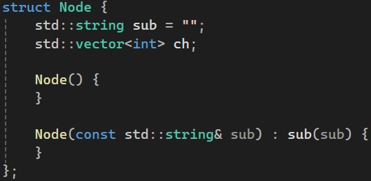
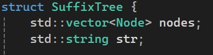
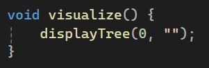
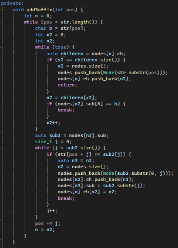
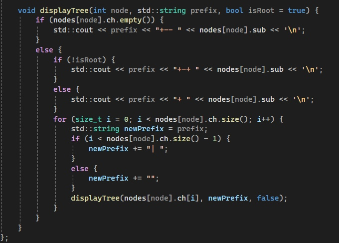
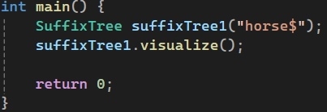

# Наивный on-line алгоритм построения суффиксного дерева за O(n^2)
## Здесь будет представлена реализация данного алгоритма, проверка на различные пограничные случаи на примере разных входных данных, его разбор и описание.
### Задача: реализовать наивный on-line алгоритм построения суффиксного дерева за O(n^3)

# Для начала разберем терминологию задачи:

### Суффиксное дерево
Суффиксное дерево — это структура данных, используемая в алгоритмах для эффективного решения различных задач, связанных с обработкой строк, таких как поиск подстроки, наибольшего общего префикса, различных вхождений и других. Суффиксное дерево представляет собой дерево, в котором каждый суффикс строки представлен как путь от корня до листа.

Основная идея суффиксного дерева заключается в том, что каждый суффикс строки представляется в дереве таким образом, чтобы не возникало дублирования данных. Это достигается путем представления каждого суффикса как пути от корня до листа, причем суффиксы, которые имеют общий префикс, разделяют этот префикс. Таким образом, суффиксное дерево позволяет эффективно хранить и обрабатывать все суффиксы строки.

### Наивный алгоритм
Наивный алгоритм (иногда называемый простым или элементарным) - это простейший способ решения задачи или выполнения операции в программировании. Он часто выбирается из-за своей простоты в реализации.

### On-line алгоритм
Термин "online алгоритм" обычно относится к способу обработки данных, при котором алгоритм способен обрабатывать данные по мере их поступления, не храня их все целиком в памяти. Такие алгоритмы обрабатывают данные порциями или по одной записи за раз, что позволяет им работать с большими объемами данных без необходимости хранить их целиком в памяти.

# Реализация на Си++
Разберем структуру алгоритма

|Структура узла|Класс для построения суффиксного дерева|Конструктор класса|Метод для визуализации дерева|Функция для добавления суффикса в дерево|Функция для визуализации дерева|Функция вывода|
|----------------|----------------|----------------|---------------|---------------|---------------|---------------|
||||||||
