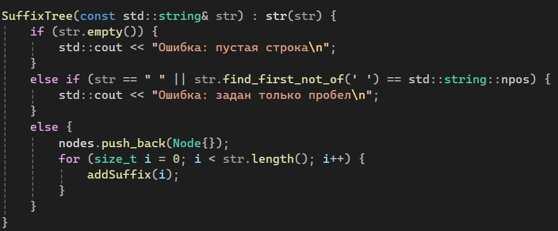

# Наивный on-line алгоритм построения суффиксного дерева за O(n^2)
 Здесь будет представлена реализация данного алгоритма, проверка на различные пограничные случаи на примере разных входных данных, его разбор и описание.
### Задача: реализовать наивный on-line алгоритм построения суффиксного дерева за O(n^2)

# Для начала разберем терминологию задачи:

### Суффиксное дерево
Суффиксное дерево — это структура данных, используемая в алгоритмах для эффективного решения различных задач, связанных с обработкой строк, таких как поиск подстроки, наибольшего общего префикса, различных вхождений и других. Суффиксное дерево представляет собой дерево, в котором каждый суффикс строки представлен как путь от корня до листа.

Основная идея суффиксного дерева заключается в том, что каждый суффикс строки представляется в дереве таким образом, чтобы не возникало дублирования данных. Это достигается путем представления каждого суффикса как пути от корня до листа, причем суффиксы, которые имеют общий префикс, разделяют этот префикс. Таким образом, суффиксное дерево позволяет эффективно хранить и обрабатывать все суффиксы строки.

### Наивный алгоритм
Наивный алгоритм (иногда называемый простым или элементарным) - это простейший способ решения задачи или выполнения операции в программировании. Он часто выбирается из-за своей простоты в реализации.

### On-line алгоритм
Термин "online алгоритм" обычно относится к способу обработки данных, при котором алгоритм способен обрабатывать данные по мере их поступления, не храня их все целиком в памяти. Такие алгоритмы обрабатывают данные порциями или по одной записи за раз, что позволяет им работать с большими объемами данных без необходимости хранить их целиком в памяти.

# Реализация на Си++

|Структура узла|Класс для построения суффиксного дерева|Конструктор класса|Метод для визуализации дерева|Функция для добавления суффикса в дерево|Функция для визуализации дерева|Функция вывода|
|----------------|----------------|----------------|---------------|---------------|---------------|---------------|
||||||||

### Разберем структуру алгоритма

1. Структура узла **Node**:
   - Node представляет узел дерева суффиксов;
   - В структуре Node определены два поля: **sub** для хранения подстроки и **ch** для хранения индексов дочерних узлов;
   - Конструкторы в **Node** позволяют создавать узлы с пустой подстрокой или с заданной подстрокой;
   - Эта структура представляет базовый элемент суффиксного дерева, который хранит информацию о подстроке и связях с другими узлами.

2. Класс для построения суффиксного дерева **SuffixTree**:
   - **SuffixTree** представляет собой класс для построения и визуализации суффиксного дерева;
   - В классе есть приватные поля: **nodes** для хранения узлов дерева и **str** для хранения входной строки;
   - Конструктор класса инициализирует дерево на основе входной строки;
   - Метод **visualize** вызывает приватный метод **displayTree** для визуализации структуры дерева;
   - Приватные методы **addSuffix** и **displayTree** отвечают за добавление суффиксов и отображение дерева соответственно.
  
3. Конструктор класса **SuffixTree**:
   - В конструкторе происходит инициализация дерева на основе входной строки;
   - Если входная строка пустая или состоит только из пробелов, выводится сообщение об ошибке;
   - Далее создается корневой узел и добавляются суффиксы в дерево.
  
4. Метод для визуализации дерева **visualize**:
   - Метод **visualize** вызывает метод **displayTree** с начальными параметрами для визуализации дерева;
   - Он предоставляет интерфейс для пользователя для отображения структуры суффиксного дерева.
  
5. Функция для добавления суффикса **addSuffix**:
   - Функция **addSuffix** добавляет суффикс в дерево, начиная с указанной позиции в строке;
   - Внутри функции происходит обход дерева и добавление новых узлов при необходимости.
  
6. Функция для визуализации дерева **displayTree**:
   - Функция **displayTree** рекурсивно отображает структуру дерева с отступами для наглядности;
   - Она использует символы +, | и - для отображения связей между узлами и их уровнями.
  
7. Главная функция **main**:
   - В функции main создается объект класса **SuffixTree** с входной строкой "horse$";
   - Далее вызывается метод **visualize**, который отображает структуру суффиксного дерева на экране;
   - В результате на экране будет выведена визуализация дерева с отступами для каждого узла.

## Почему этот код можно считать наивным онлайн алгоритмом за O(n^2)

1. Алгоритм сканирует входную строку посимвольно и добавляет каждый суффикс в дерево, пройдя по уже построенной структуре для поиска совпадений. Это подходит под определение наивного метода, так как не используется более сложных структур данных или оптимизаций для ускорения процесса.

2. Создание всех суффиксов займет O(n^2) времени поскольку процесс построения суффиксного дерева начинается с построения суффикса для каждого суффикса строки. Для строки длины n существует n суффиксов, и для каждого суффикса требуется выполнить линейный проход по его символам.
   
    2.1. Построение дерева также имеет сложность O(n^2) поскольку для каждого суффикса создается ребро в суффиксном дереве. При этом алгоритм должен обрабатывать каждый символ суффикса и сравнивать его с уже существующими узлами и ребрами в дереве.

# Вывод терминала. Структура суффиксного дерева
Расмотрим вывод терминала, то есть, структуру суффиксного дерева на примере заданной строки без повторяющихся символов.
Возьмем для примера раннее введеную строку "horse$". Важно заметить, что в конце строки нужно добавлять специальный символ $ для обозначения конца этой строки. Этот символ помогает различать суффиксы и предотвращает ситуации, когда один суффикс является префиксом другого. В общем случае, важно, чтобы он был добавлен в конец строки до начала построения суффиксного дерева. Это можно сделать как внутри алгоритма, так и вводом в заданной строке, как это сделанно в реализованном мной коде.

- Первый узел дерева содержит подстроку "horse$", далее следуют узлы с подстроками "orse$", "rse$", "se$", "e$", и "$";
- Вертикальные линии "|" указывают на то, что узлы на том же уровне в дереве, а символы "+" и "-" в свою очередь обозначают узел дерева и связь между узлами соответсвенно, что помогает визуально отобразить структуру дерева.

# Пограничные случаи
|Повторяющиеся символы|Строка палиндром|Пустая строка|Строка содержащая только пробел|
|----------------|----------------|----------------|---------------|
|||||
|Метод addSuffix добавляет суффиксы в дерево, начиная с указанной позиции. При наличии совпадений символов, создаются новые узлы для разделения суффиксов, и каждый узел хранит свою подстроку и ссылки на дочерние узлы.|Для строки палиндром в дереве будут отражены особенности, такие как повторяющиеся подстроки и симметричные узлы, отражающие симметрию палиндрома.|Конструктор класса SuffixTree в случае пустой строки выдает ошибку.|Конструктор класса SuffixTree в случае строки содержащую только пробел выдает ошибку.|

# Вывод

В ходе данной работы был реализован наивный онлайн алгоритм построения суффиксного дерева, обладающий временной сложностью O(n^2). Данный алгоритм позволяет построить суффиксное дерево для любой входной строки, сохраняя структуру и отражая все возможные суффиксы данной строки. 

Алгоритм работает на различных входных данных. Так же он был протестирован на пограничные случаи, и в результате, строки с повторяющимися символами, строки-палиндромы, а также случаи, когда введена либо пустая строка, либо же только пробел были успешно обработаны. Это позволило установить корректность и эффективность его работы.

